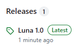
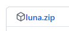

### First, a screenshot:

### Second, how to install:

- Head to the releases: 
- Download the ZIP file: 
- Go to the Extensions page in Chrome (chrome://extensions).
- Enable Developer Mode: 
- Drag the ZIP file and drop it onto the Extensions page.
- Voila! The theme will have been applied.